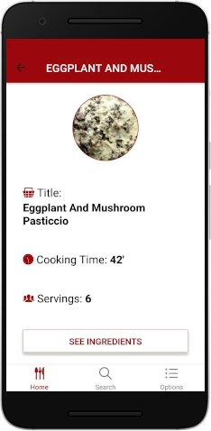
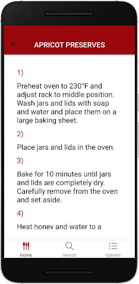

# Gusteaux

Are you going to have a dinner with your friends and you don't know what to cook? Do you hate looking into that 500 pages recipe book weighting 7.5Kg that has been in your shelf for years? Don't you like having your favourite recipes always available for you?

Then you should try Gusteaux, the application that holds your recipes and makes everything comfy in the preparation of your delicious dinner. 

### Home

Use your Home tab to see your saved recipes! 

Sort them by name or by the time you need to prepare them. 

Add a custom recipe or modify an existing one.

Look at the recipe, adjust the number of servings and start to cook it!

### Search

Search the recipes you want to cook!

Search them by typing the name of the recipe or insert the ingredients and find a suggested recipe. 

You can search by ingredients to use as many ingredients you wrote as possible (before shopping) or to have the least number of missing ingredients (post shopping).

Navigate through the searched recipes and save your favourite ones.

### Settings

Customize Gusteaux in the Settings tab!

Select your intolerances and insert the ingredients you don't like. They will be avoided in the recipes found through the Search by Name mode.

Choose the main color of each tab and make Gusteaux look as you prefer.

### Random Recipe

 

Out of imagination? Shake your device and Gusteaux will suggest you a recipe. Save it if you like it!

## The Project

The goal of this project is to develop an application for searching, inserting and navigating through recipes.

The recipes will be obtained using [*spoonacular API*](https://spoonacular.com/food-api/docs), that provides recipes together with ingredients and steps to cook them.

The features that the application will provide are the following:

- Search recipes by name
- Search recipes by ingredients (also with exclusion)
- Save favourite recipes
- Insert a new recipe
- See recipe's infos
- Modify saved recipes
- Get a random recipe
- Set intolerances or ingredients to exclude
- Change main color of the application's tabs

#### Search Recipes by Name

The user has the possibility to search a recipe providing its name. Results will then be fetched using *spoonacular API* and presented to the user. 

#### Search Recipes by Ingredient

The user will be able to propose ingredients to get recipes including them. There will be two possible *Recipe by Ingredients Search*: one aiming at maximizing the usage of the given ingredients; one aiming at minimizing the ingredients that are not present in the given list.

#### Save favourite Recipes

The user will be able to save the recipes that he likes, so that they are shown in the Home Screen. 

#### See Recipe's infos

When a recipe is selected instruction are shown to reproduce it. The user should be able to select the amount of servings that he'd like to cook in order to adjust the quantity of the ingredients.

#### Insert a Recipe

The user should be able to insert its own recipe in the application. It should provide ingredients (together with quantities), instructions to cook it and possibly an image describing it. The image shall be chosen among the pictures in the phone or directly taken with the camera.

#### Modify a saved Recipe

The user should be able to modify a saved recipe changing instructions, ingredients quantities and image.

#### Get a Random Recipe

When the chef is out of imagination, by shaking the device, a random recipe should be shown.

#### Set Intolerances or Ingredients to exclude

The user should be able to customize the application by setting its own intolerances or ingredients he doesn't like. In this way recipe containing those ingredients will be automatically avoided in the search by name mode.

#### Change main color of Gusteau

The user should be able to change the main color of each tab.
